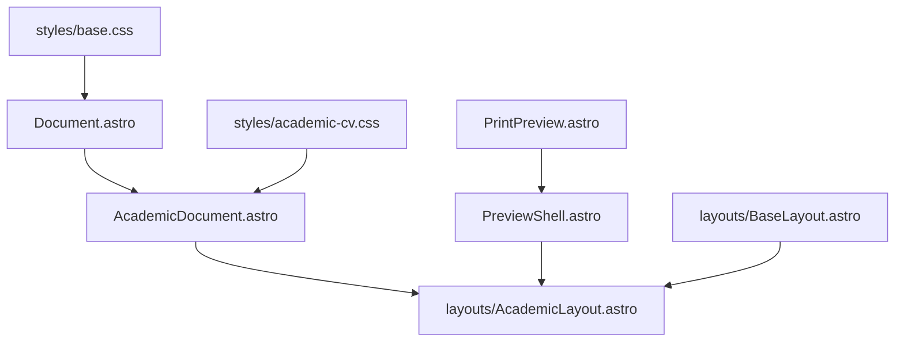

# astroprint — print-ready Markdown for Astro

[](https://www.npmjs.com/package/astroprint)
[](https://github.com/atomiechen/astroprint)
[](https://deepwiki.com/atomiechen/astroprint)


Print-ready Markdown documents for [Astro](https://astro.build/), with normal web preview, Paged.js preview, and PDF export.

Use `astroprint` for CVs, reports, notes, and other Markdown-first documents that should stay editable as Astro pages while still exporting clean PDFs. It uses Astro's content, layout, asset, and dev-server behavior, then adds print-oriented Markdown transforms, optional injected document routes, paged preview, and a PDF CLI.

## Quick Start

Add the integration to an Astro project:

```bash
npm create astro@latest my-docs
cd my-docs
npx astro add astroprint
```

This installs `astroprint` and updates `astro.config.mjs` with the default integration setup.
Use the equivalent `pnpm astro add`, `yarn astro add`, or `bunx astro add` command if your project uses another package manager.

`astroprint` currently targets Node 20+ and Astro 5.

With no options, the integration only installs Markdown processing plugins for directives, `:logolink`, BibTeX conversion, and HTML comment stripping. `astro add` imports it as `print` by default, so use normal Astro pages and layouts when you want to control routes yourself:

```js title="astro.config.mjs"
import { defineConfig } from "astro/config";
import print from "astroprint";

export default defineConfig({
  integrations: [print()],
});
```

The integration also excludes astroprint-generated work directories matching `**/.astroprint*/**` from Vite's dev-server watcher.

Add `injectedRoutes` only when you want `astroprint` to inject collection-backed document routes. Each injected route must provide an explicit `route`; astroprint will not guess a public URL for you. Add top-level `pdf` when you want `astroprint pdf` to work without passing `--route`:

```js title="astro.config.mjs"
// astro.config.mjs
import { defineConfig } from "astro/config";
import print from "astroprint";

export default defineConfig({
  integrations: [
    print({
      injectedRoutes: [
        {
          collection: "cv",
          route: "/astroprint",
          // Optional. Set true for /astroprint-preview, or pass a custom path.
          previewRoute: true,
          defaultId: "main",
          // Optional. Defaults to true for normal astro build.
          injectDuringBuild: false,
        },
      ],
      pdf: {
        route: "/astroprint",
        outputDir: "public",
        backend: "weasyprint",
      },
    }),
  ],
});
```

By default, configured injected routes are emitted during normal `astro build`, so `/astroprint/` can be part of your production site. Set `injectDuringBuild: false` on an injected route when you only want it during `astro dev` and `astroprint pdf`; the PDF command always enables route injection internally with `ASTROPRINT_RENDER_HTML=true`.

Paged preview routes are opt-in. Omit `previewRoute` or set `previewRoute: false` to inject only the normal route. Set `previewRoute: true` to inject the default preview path (`${route}-preview`, or `/preview` for `/`), or pass a string such as `previewRoute: "/astroprint-preview"`.

Define the content collection:

```ts
// src/content.config.ts
import { defineCollection, z } from "astro:content";
import { glob } from "astro/loaders";

const cv = defineCollection({
  loader: glob({ pattern: "**/*.md", base: "src/content/cv" }),
  schema: z.object({
    title: z.string().optional(),
    secondaryTitle: z.string().optional(),
  }),
});

export const collections = { cv };
```

The generated route passes the raw collection `entry` to the configured layout. The built-in academic layout maps `title`/`secondaryTitle`; custom layouts can use any frontmatter shape.

Add at least one Markdown file to the collection:

```md title="src/content/cv/main.md"
---
title: Ada Lovelace
secondaryTitle: Computing Notes
---

:::::ul{.two-col}

::::entry
:::col
**Example University**
:::

:::col
2026
:::
::::

:::::
```

The filename becomes the document id. This example uses `main.md` because the injected route config above sets `defaultId: "main"`, so it renders at `/astroprint/`. Other ids render at paths such as `/astroprint/example/`, or you can change `defaultId`.

Run Astro for development:

```bash
npx astro dev
```

Then open:

- `/astroprint/` for the normal document view
- `/astroprint-preview/` for Paged.js pagination preview, if `previewRoute` is enabled

Generate the final PDF:

```bash
npx astroprint pdf
```

Supported PDF backends:

| Backend | Install |
| --- | --- |
| `weasyprint` (default) | Install the `weasyprint` command for your platform. See the [WeasyPrint installation guide](https://doc.courtbouillon.org/weasyprint/stable/first_steps.html#installation). |
| `playwright` | Install Playwright and a browser for your environment. See the [Playwright browser installation guide](https://playwright.dev/docs/browsers). |

For `weasyprint`, set `WEASYPRINT_BIN=/path/to/weasyprint` when the executable is not named `weasyprint` or is not on `PATH`.

For manually routed pages, pass the route explicitly:

```bash
npx astroprint pdf --route /cv-notes/
```

## Markdown Directives

`astroprint` installs `remark-directive` and maps lightweight directives to semantic HTML classes:

```md
:::::ul{.two-col}

::::entry
:::col
**Tsinghua University**

Ph.D. Candidate
:::

:::col
Beijing, China

2020-2026
:::
::::

:::::
```

The built-in academic CV theme styles these classes through `astroprint/styles/academic-cv.css`, imported by the academic layouts. Treat directives and CSS as a pair: directives give Markdown a small semantic vocabulary, and the stylesheet defines how that vocabulary renders.

Use directive attributes for CSS classes, for example `:::::ul{.two-col}`. The bracket form is directive label/content syntax, so `:::ul[two-col]` is not recommended for classes.

You can add your own vocabulary through the integration `directives` option:

```js title="astro.config.mjs"
import { defineConfig } from "astro/config";
import print from "astroprint";

export default defineConfig({
  integrations: [
    print({
      directives: {
        callout: {
          tag: "aside",
          className: "my-callout",
        },
        timeline: {
          tag: "ol",
          className: "my-timeline",
        },
      },
    }),
  ],
});
```

Then provide matching CSS from your layout or theme stylesheet.

HTML comments in Markdown are stripped by default. Set `stripHtmlComments: false` in the integration options when you need comments to remain in the rendered HTML.

BibTeX code blocks with `style=acm`, `style=apa`, or `style=ieee` are converted to publication HTML at build time:

````md
```bibtex style=acm
@inproceedings{example,
  author = {Ada Lovelace and Grace Hopper},
  title = {Computing Notes},
  year = {2026},
  booktitle = {Proceedings of Example Conference}
}
```
````

Set `bibtex: false` to leave BibTeX code blocks untouched, or pass `bibtex: { style: "apa", highlightedAuthors: ["Ada Lovelace"] }` to set global defaults. Local code-block meta wins over global options, so `style=ieee highlight="Ada Lovelace"` can configure one BibTeX block. Style names are case-insensitive. `acm` uses a built-in ACM DL-like formatter; `apa` and `ieee` use bundled CSL styles from the Citation Style Language styles repository. Pass `lang` globally or in code-block meta, for example `style=apa lang=en-US`, when a CSL-backed style should use a specific locale.

## Custom Layouts

`astroprint` separates document structure from route shell. Use the smallest component that matches the surface you are building:



- `Document.astro` provides the default document root and baseline page styles.
- `AcademicDocument.astro` provides `Document` plus the built-in academic theme and title block.
- `PrintPreview.astro` provides the document-agnostic Paged.js wrapper.
- `PreviewShell.astro` provides the normal/preview navigation, print button, scroll restoration, and optional `PrintPreview`.
- `AcademicLayout.astro` provides the built-in academic document surface and uses `PreviewShell` when generated routes pass `withRouteShell={true}`.

When a custom theme wraps `PreviewShell.astro`, it mainly needs to map collection data into markup and import its own stylesheet:

```astro title="src/layouts/MyThemedDocumentLayout.astro"
---
import type { ComponentProps } from "astro/types";
import Document from "astroprint/components/Document.astro";
import PreviewShell from "astroprint/components/PreviewShell.astro";
import BaseLayout from "./BaseLayout.astro";
import "./my-document.css";

type Props = ComponentProps<typeof PreviewShell> & {
  secondaryTitle?: string;
  entry?: {
    id?: string;
    data?: Record<string, unknown>;
  };
};

const { entry } = Astro.props;
const title =
  Astro.props.title ??
  (typeof entry?.data?.title === "string" ? entry.data.title : undefined) ??
  entry?.id;
const secondaryTitle =
  Astro.props.secondaryTitle ??
  (typeof entry?.data?.secondaryTitle === "string" ? entry.data.secondaryTitle : undefined);
---

<BaseLayout pageTitle={title}>
  <PreviewShell {...Astro.props}>
    <Document>
      <h1 class="my-title">
        <span>{title}</span>
        {secondaryTitle && <span>{secondaryTitle}</span>}
      </h1>
      <slot />
    </Document>
  </PreviewShell>
</BaseLayout>
```

Then point the generated route at that layout:

```js title="astro.config.mjs"
import { defineConfig } from "astro/config";
import print from "astroprint";

export default defineConfig({
  integrations: [
    print({
      injectedRoutes: [
        {
          collection: "cv",
          layout: "./src/layouts/MyThemedDocumentLayout.astro",
          route: "/astroprint",
          previewRoute: true,
        },
      ],
    }),
  ],
});
```

Relative `layout` paths are resolved from your Astro project root. Package specifiers and aliases, such as `astroprint/layouts/AcademicLayout.astro` or `@/layouts/MyDocumentLayout.astro`, are passed through to Astro/Vite. The generated route passes rendered Markdown as the slot, plus route props such as `withRouteShell`, `normalHref`, optional `previewHref`, `printPreview`, `entry`, and `documentConfig`.

For a completely custom template, create your own layout and stylesheet, then use the directive classes generated by `astroprint` (`.astroprint-entry`, `.two-col`, and so on), or extend the directive mapping with the integration `directives` option.

For standalone Markdown pages that should use the built-in academic document surface without generated document routes, navigation, paged preview, or PDF behavior, set the page frontmatter layout. The academic layout defaults to `BaseLayout.astro`; generated routes pass `withRouteShell={true}` to use `PreviewShell.astro`.

```md title="src/pages/cv-notes.md"
---
layout: astroprint/layouts/AcademicLayout.astro
title: CV Notes
secondaryTitle: Draft
---

:::::ul{.two-col}

::::entry
:::col
**Example**
:::

:::col
2026
:::
::::

:::::
```

## Commands

```bash
astroprint dev          # thin wrapper around astro dev
astroprint build        # thin wrapper around astro build
astroprint pdf          # Generate from the configured pdf.route
astroprint pdf mydoc    # Generate from pdf.route plus /mydoc/
astroprint pdf a/b/c    # Generate from pdf.route plus /a/b/c/
astroprint pdf --route /cv-notes/  # Generate from a regular Astro route
astroprint pdf --route /cv-notes/ --output-dir public
```

The PDF command sets `ASTROPRINT_RENDER_HTML=true` so injected normal routes are generated for export, regardless of each injected route's `injectDuringBuild` setting. `previewRoute` remains opt-in. Without top-level `pdf`, use `--route` to print an existing Astro page; `astroprint` will not guess a default PDF route.

`astroprint pdf` builds temporary HTML into `.astroprint/` before rendering the PDF.

`npx astroprint ...` runs the `astroprint` CLI, but the Playwright backend imports the `playwright` package from the project at runtime. Install Playwright in the project when using `backend: "playwright"`; `npx playwright ...` is useful for Playwright's own install/setup commands, but it does not replace the runtime dependency.

Each injected route config must include `route`; astroprint does not inject a default route path. `pdf.route` and `--route` accept either `/cv-notes` or `/cv-notes/`; `astroprint` resolves both against Astro's static output and uses a trailing slash internally for directory routes so relative assets keep the same base URL. `pdf.document` and the optional `astroprint pdf [document]` positional argument append a document path to the selected route, so `pdf.route: "/cv"` plus `astroprint pdf mydoc` prints `/cv/mydoc/`. The positional argument overrides `pdf.document`; omit it to print the base route as before.

`pdf.output`, `pdf.outputDir`, `--output`, and `--output-dir` are normal filesystem paths, not Astro routes. `outputDir` is the base directory, and `output` is resolved inside it. Absolute `output` paths are used as-is. Relative paths are resolved from the project root/current working directory. For example, `outputDir: "public"` plus `/cv-notes` writes `public/cv-notes.pdf`; `outputDir: "public"` plus `output: "CV.pdf"` writes `public/CV.pdf`.

CLI options override the matching config fields, so `--backend` overrides `pdf.backend`, `--output-dir` overrides `pdf.outputDir`, and `--output` overrides `pdf.output`. If no output is specified, the filename is derived from the route: `/` becomes `index.pdf`, `/cv-notes` becomes `cv-notes.pdf`, and `/nested/report` becomes `report.pdf`. If `--port` is omitted, `astroprint` asks the OS for an available temporary port; if `--port` is provided, that exact port is used.

## Maintainers

Maintainer notes, including the vendored Paged.js refresh workflow, live in [`AGENTS.md`](https://github.com/atomiechen/astroprint/blob/main/AGENTS.md).
